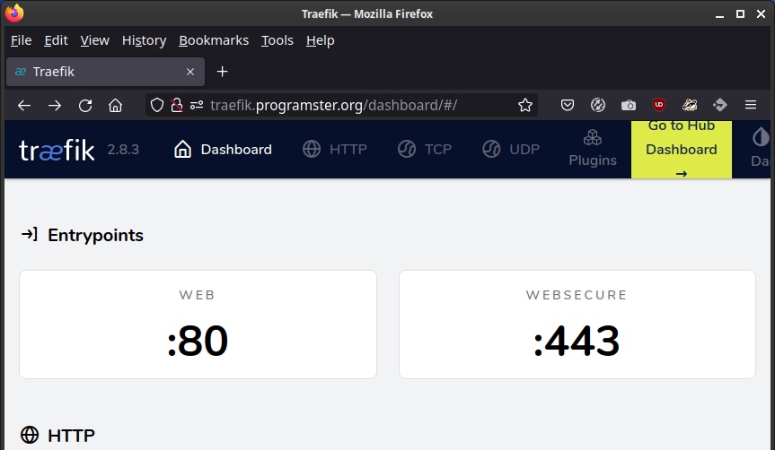
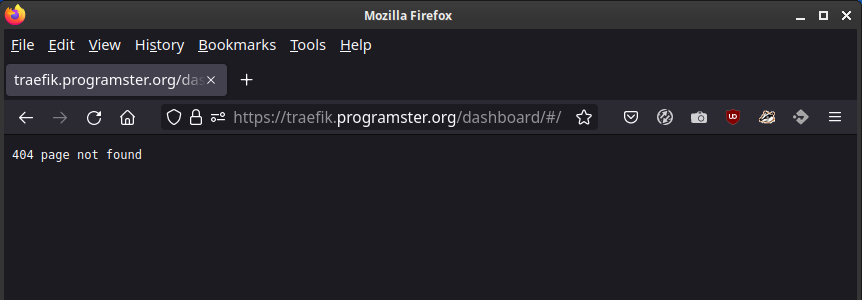

Traefik Dashboard Issue Demo
=============================

This is an example codebase to demonstrate my issue with trying to set up a secure dashboard.

## Usage
1. Generate a wildcard certificate for your domain, and replace the `./ssl/private.pem` and `.
   /ssl/site.crt` files with it.
2. Update the dynamic-conf.yml file and replace `traefik.mydomain.com` with an appropriate domain
   for your wildcard certificate.
3. Update your `/etc/hosts` file to point to 127.0.0.1 or update your DNS records to point to 
   wherever you are going to be deploying this Traefik codebase.
4. Run `docker-compose up` to deploy Traefik.
5. Notice that you can go to the dashboard by going to `http://localhost/dashboard/` and login with:
   * username: `admin` 
   * password: `password`
6. You should also be able to get there by going to the domain you entered in step 2 as long as 
   you use `http://`
   * 
7. However, not when you use `https://`, which is the issue this codebase is trying to demonstrate.
   * 